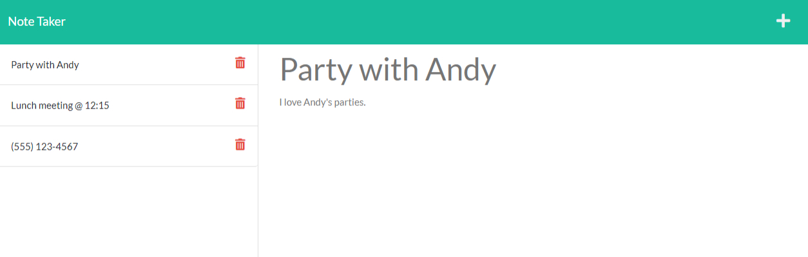

# Back-End Note Taker App

## Description
This is a server-side note taking application. It uses Fetch GET, POST, and DELETE methods to save and return data to the user.

## Installation
This application is hosted via GitHub and Heroku. No download or installation is needed; simply run it from [this link](https://salty-refuge-82492.herokuapp.com/).

## Usage
The above link will take the user to a landing page. Clicking the Get Started button will take the user to a notes page where notes can be entered and saved.

Once the user has entered a title and body text for a note, a save icon will appear in the upper-right corner of the screen. Saved notes are written into a json database file which will be parsed and rendered each time the page is loaded.

Saved notes can be clicked to display their body text. When a note is displayed this way, the user can click the plus icon in the upper-right corner to clear the fields and start a new note.

The user can click on the trash bin icon next to each saved note to remove it from the list and the database.

## Tools Used
* JavaScript
* Express.js
* Node.js
* NPM
* fs
* GitHub
* Heroku
* GitBash
* Coded in VS Code

## Future Functionality
* We could make notes loaded from storage display as a modal instead of filling in the input forms.
* We could allow more robust validation for whether a note is valid for submission.
* We could add categories for notes, with unique images/styling.
